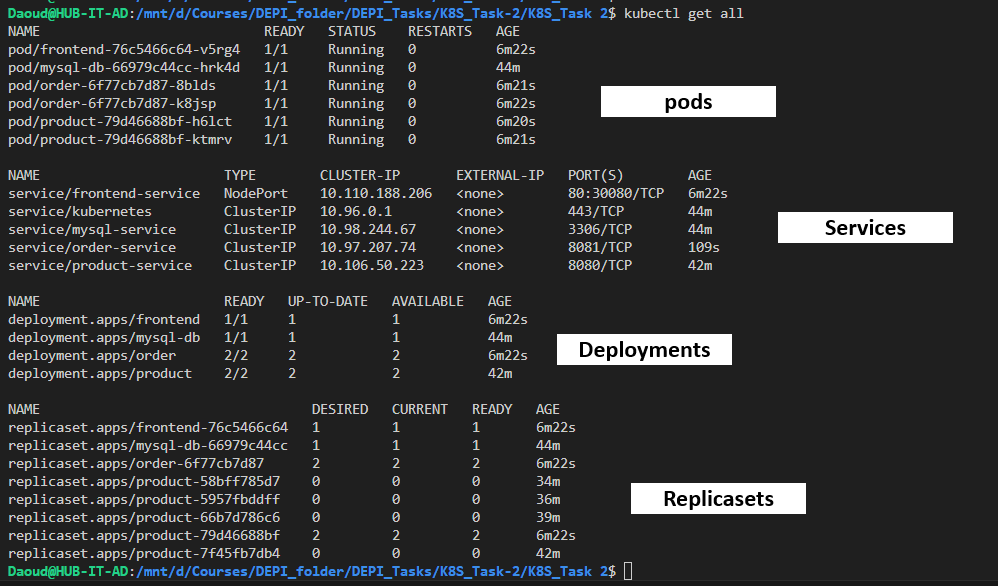
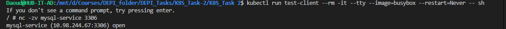
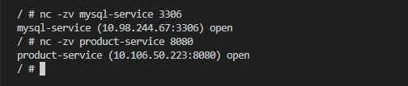
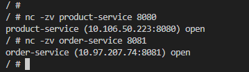
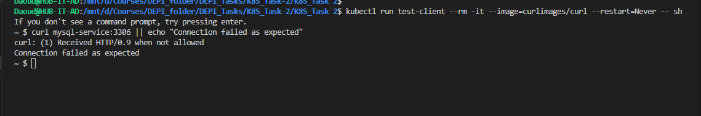
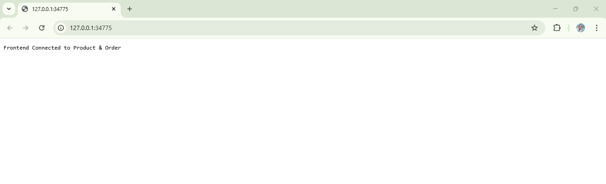

## Kubernetes YAML Files

- [mysql-db.yaml](./db.yml)
- [frontend.yaml](./fe.yml)
- [product.yaml](./product.yml)
- [order.yaml](./order.yml)
- [networkpolicy.yaml](./networkpolicy.yml)

*** Results Documentation ***
- output of get all command

## 1. Product → Database

**Command:**
kubectl run test-client --rm -it --tty --image=busybox --restart=Never -- sh -c "nc -zv mysql-service 3306

**Result:**
mysql-service (10.99.156.207:3306) open

Product service can connect to Database.

##### ############################################
## 2. Order → Database & Product

**Commands:**
kubectl run test-client --rm -it --tty --image=busybox --restart=Never -- sh -c "
nc -zv mysql-service 3306;
nc -zv product-service 8080;

**Result:**
mysql-service (10.99.156.207:3306) open
product-service (10.106.50.223:8080) open

Order service can connect to Database & Product service.

##### ############################################
## 3. Frontend → Product & Order

**Commands:**
kubectl run test-client --rm -it --tty --image=busybox --restart=Never -- sh -c "
nc -zv product-service 8080;
nc -zv order-service 8081;

**Result:**
product-service (10.106.50.223:8080) open
order-service (10.97.207.74:8081) open

Frontend can connect to Product & Order.

##### ############################################
## 4. Frontend → Database (should fail after NetworkPolicy)

**Command:**
kubectl run test-client --rm -it --tty --image=busybox --restart=Never -- sh -c "nc -zv mysql-service 3306 || echo 'Connection failed as expected'"

**Result:**
Connection failed as expected

NetworkPolicy blocks Frontend from Database.

##### ############################################
## 5. Frontend NodePort Access (External)

**Command:**
   minikube ip

**Minikube IP:** `192.168.58.2`  
**Frontend NodePort:** `30080`

**Access Test:**
curl 192.168.58.2:30080

**Result:**
Frontend Connected to Product & Order

Frontend accessible externally through NodePort.

