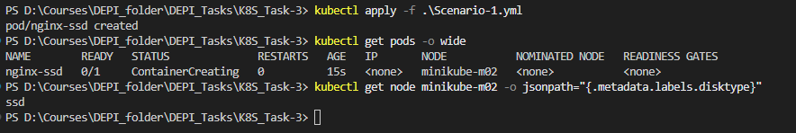
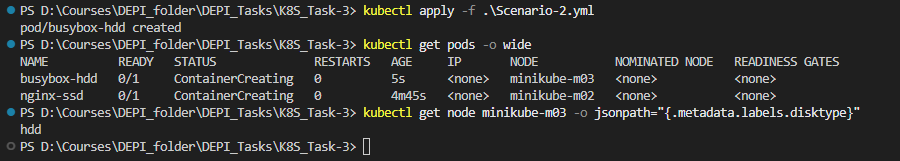
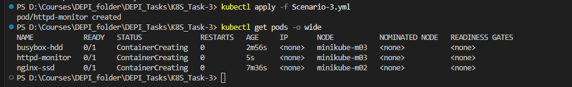
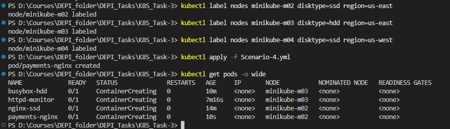

# Kubernetes Scheduling Assignment

---

## Scenario-1

### 1. [Scenario-1.yml](Scenario-1.yml)
### 2. Scenario-1.png  

### 3. Explanation
The Pod specifies `nodeSelector: disktype=ssd`.  
Kubernetes scheduler will only place the Pod on nodes with the label `disktype=ssd`.  
Since **Node1** is labeled `ssd`, the Pod is correctly scheduled there.

---

## Scenario-2

### 1. [Scenario-2.yml](Scenario-2.yml)
### 2. Scenario-2.png  

### 3. Explanation
The Pod uses **required Node Affinity** with `disktype=hdd`.  
This means scheduling is strict: the Pod can only run on nodes with this label.  
Therefore, the Pod is scheduled only on **Node2**, which has `hdd`.

---

## Scenario-3

### 1. [Scenario-3.yml](Scenario-3.yml)
### 2. Scenario-3.png  

### 3. Explanation
The node is tainted with `key1=value1:NoSchedule`, which blocks regular Pods.  
This Pod has a matching **toleration**, so it can bypass the taint and run there.  
As a result, the Pod is correctly scheduled on the **monitoring node**.

---

## Scenario-4

### 1. [Scenario-4.yml](Scenario-4.yml)
### 2. Scenario-4.png  

### 3. Explanation
- **Required Affinity:** Pod must run only on SSD nodes.  
- **Preferred Affinity:** Prefers `region=us-east`, so Node1 is chosen if available.  
- **Toleration:** Allows Pod to run on Node3, which is tainted, if no east SSD nodes exist.  

This ensures:  
1. Pod always runs on SSD.  
2. Scheduler tries Node1 (ssd, us-east) first.  
3. If not possible, it falls back to Node3 (ssd, us-west, tainted).  

---
