*** 1- create pod nginx with name my nginx direct from command don't use yaml file ***

   **Explanation:**
          create a Pod named my-nginx running the nginx container directly from the command line without using a YAML manifest.
          The kubectl run command is used to start a single Pod.
   **Command used:**
          kubectl run my-nginx --image=nginx 
          kubectl get pod
   **Output of the command:**
          pod/my-nginx created
          NAME       READY   STATUS    RESTARTS   AGE
          my-nginx   1/1     Running   0          8s
   **Screenshot:**
          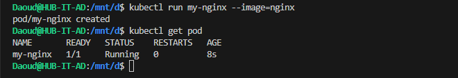

------------------------------------------------------------------------------------------------------------------
------------------------------------------------------------------------------------------------------------------

*** 2-create pod nginx with name my nginx command and use Image nginx123  direct from command don't use yaml fil ***

   **Explanation:**
          Creates a new Pod directly from the command line without needing a YAML file.
   **Command used:**
          kubectl run my-nginx --image=nginx123
          kubectl get pod
   **Output of the command:**
          pod/my-nginx created
          NAME       READY   STATUS         RESTARTS   AGE
          my-nginx   0/1     ErrImagePull   0          4s
   **Screenshot:**
          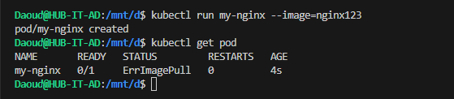   

------------------------------------------------------------------------------------------------------------------
------------------------------------------------------------------------------------------------------------------

*** 3-check the status and why it doesn't work ***

   **Explanation:**
          Kubernetes tried to pull the image (nginx123) but failed.The image nginx123 does not exist in Docker Hub.
   **Command used:**
          kubectl get pod
          kubectl describe pod my-nginx | grep -i "Events" -A 10
   **Output of the command:**

          NAME       READY   STATUS             RESTARTS   AGE
          my-nginx   0/1     ImagePullBackOff   0          17m
         
          Events:
            Type     Reason     Age                  From               Message
            ----     ------     ----                 ----               -------
            Normal   Scheduled  17m                  default-scheduler  Successfully assigned default/my-nginx to minikube
            Normal   Pulling    14m (x5 over 17m)    kubelet            Pulling image "nginx123"
            Warning  Failed     13m (x5 over 17m)    kubelet            Failed to pull image "nginx123": Error response from daemon: pull access denied for nginx123, repository does not exist or may require 'docker login': denied: requested access to the resource is denied
            Warning  Failed     13m (x5 over 17m)    kubelet            Error: ErrImagePull
            Normal   BackOff    2m4s (x64 over 17m)  kubelet            Back-off pulling image "nginx123"
            Warning  Failed     2m4s (x64 over 17m)  kubelet            Error: ImagePullBackOff
   **Screenshot:**
          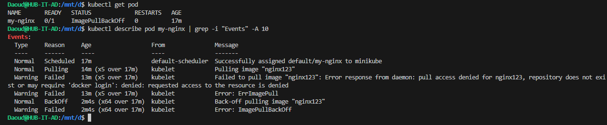

------------------------------------------------------------------------------------------------------------------
------------------------------------------------------------------------------------------------------------------       

*** 4- I need to know node name - IP - Image Of the POD ***

   **Explanation:**
          To check where a Pod is running and which image it uses, we can describe the Pod or use kubectl get with custom output formatting. This will provide:
   **Command used:**
          kubectl describe pod my-nginx
   **Output of the command:**
            Name:             my-nginx
            Namespace:        default
            Priority:         0
            Service Account:  default
            Node:             minikube/192.168.49.2
            Start Time:       Mon, 01 Sep 2025 10:31:36 +0300
            Labels:           run=my-nginx
            Annotations:      <none>
            Status:           Pending
            IP:               10.244.0.8
            IPs:
            IP:  10.244.0.8
            Containers:
            my-nginx:
                Container ID:   
                Image:          nginx123
                Image ID:       
                Port:           <none>
                Host Port:      <none>
                State:          Waiting
                Reason:       ImagePullBackOff
                Ready:          False
                Restart Count:  0
                Environment:    <none>
                Mounts:
                /var/run/secrets/kubernetes.io/serviceaccount from kube-api-access-br67n (ro)
   **Screenshot:**
          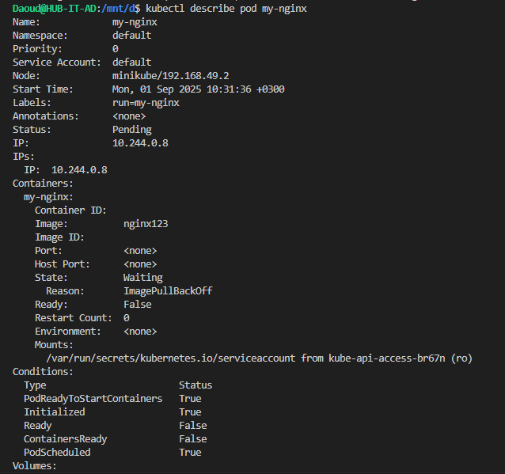  

------------------------------------------------------------------------------------------------------------------
------------------------------------------------------------------------------------------------------------------  

*** 5- delete the pod ***

   **Explanation:**
           When the Pod is no longer needed, it can be removed using the kubectl delete pod command. This permanently deletes the Pod from the cluster.
   **Command used:**
           kubectl delete pod my my-nginx
   **Output of the command:**
           pod "my-nginx" deleted
   **Screenshot:**          
             

------------------------------------------------------------------------------------------------------------------
------------------------------------------------------------------------------------------------------------------  

*** 6- create another one with yaml file and use label ***

   **Explanation:**
           we now define pod in a YAML file [pod.yml](nginx-pod.yml), YAML allows better reusability and configuration management. 
           We will also add a label to the Pod (app: myapp) so that it can be easily identified and selected later by Services, Deployments, or queries.
   **Command used:**
           kubectl apply -f nginx-pod.yml
           kubectl get pod
   **Output of the command:**
           pod/my-nginx-pod created
           NAME           READY   STATUS    RESTARTS   AGE
           my-nginx-pod   1/1     Running   0          22s
   **Screenshot:**          
          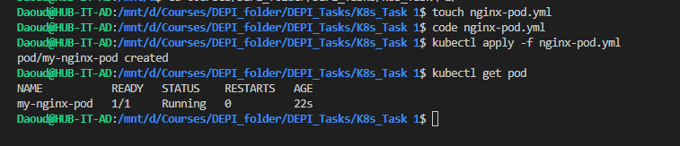             

------------------------------------------------------------------------------------------------------------------
------------------------------------------------------------------------------------------------------------------ 

*** 7-create Riplicaset with 3 replicas using nginx Image ***

   **Explanation:**
           A ReplicaSet ensures that a specified number of Pod replicas are always running. If one Pod crashes or is deleted, the ReplicaSet automatically creates a replacement. Here we will create a ReplicaSet with 3 replicas of the nginx container using [pod.yml](replicaset.yaml) file.
   **Command used:**
           kubectl apply -f replicaset.yaml
           kubectl get rs 
   **Output of the command:**
           replicaset.apps/nginx-replicaset created

           NAME               DESIRED   CURRENT   READY   AGE
           nginx-replicaset   3         3         3       8s
   **Screenshot:**          
          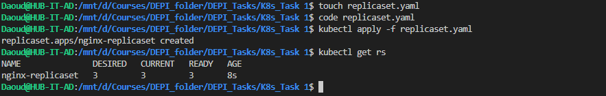 

------------------------------------------------------------------------------------------------------------------
------------------------------------------------------------------------------------------------------------------  

*** 8-scale the replicas to 5 without edit in the Yaml file ***

   **Explanation:**
           to scale a ReplicaSet without modifying the original YAML definition.
           This can be done using the kubectl scale command, which updates the desired replica count dynamically.
   **Command used:**
           kubectl scale replicaset nginx-replicaset --replicas=5
           kubectl get rs
           kubectl get pod
   **Output of the command:**
           replicaset.apps/nginx-replicaset scaled

           NAME               DESIRED   CURRENT   READY   AGE
           nginx-replicaset   5         5         5       6m38s
   
            NAME                     READY   STATUS    RESTARTS   AGE
            my-nginx-pod             1/1     Running   0          15m
            nginx-replicaset-52tzj   1/1     Running   0          16s
            nginx-replicaset-88xfd   1/1     Running   0          16s
            nginx-replicaset-b8mdg   1/1     Running   0          6m47s
            nginx-replicaset-bppdm   1/1     Running   0          6m47s
            nginx-replicaset-mwbh8   1/1     Running   0          6m47s
   **Screenshot:**          
          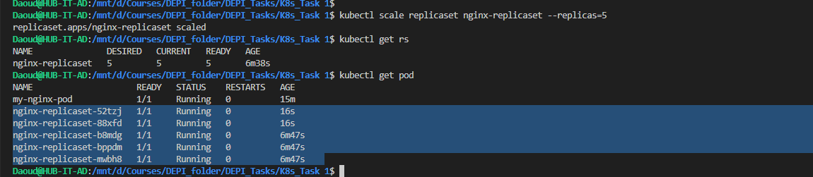    

------------------------------------------------------------------------------------------------------------------
------------------------------------------------------------------------------------------------------------------  

*** 9-Delete any one of the 5 pods and check what happen and explain  ***

   **Explanation:**
           ReplicaSet is designed to maintain the desired number of replicas (Pods). If a Pod is deleted manually, the ReplicaSet controller will immediately create a new Pod to replace it, ensuring the replica count remains at 5.
   **Command used:**
           kubectl delete pod nginx-replicaset-52tzj
           kubectl get pods -l app=nginx-app
   **Output of the command:**
        pod "nginx-replicaset-52tzj" deleted

        NAME                     READY   STATUS              RESTARTS   AGE
        nginx-replicaset-88xfd   1/1     Running             0          8m45s
        nginx-replicaset-b8mdg   1/1     Running             0          15m
        nginx-replicaset-bppdm   1/1     Running             0          15m
        nginx-replicaset-dd2kz   0/1     ContainerCreating   0          2s
        nginx-replicaset-mwbh8   1/1     Running             0          15m
   **Screenshot:**          
          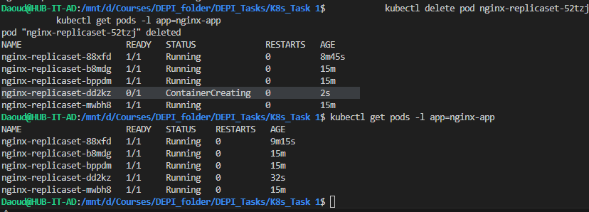                  

------------------------------------------------------------------------------------------------------------------
------------------------------------------------------------------------------------------------------------------  

*** 10-Scale down the pods aging to 2 without scale command use terminal  ***

   **Explanation:**
           to reduce the number of replicas from 5 to 2 without using the kubectl scale command. This can be achieved by editing the ReplicaSet definition directly from the terminal. Kubernetes allows live editing of resources using the kubectl edit command.
   **Command used:**
           kubectl edit replicaset nginx-replicaset
           kubectl get rs
           kubectl get pods -l app=nginx-app
   **Output of the command:**
           replicaset.apps/nginx-replicaset edited

           NAME               DESIRED   CURRENT   READY   AGE
           nginx-replicaset   2         2         2       41m

           NAME                     READY   STATUS    RESTARTS   AGE
           nginx-replicaset-b8mdg   1/1     Running   0          41m
           nginx-replicaset-mwbh8   1/1     Running   0          41m
   **Screenshot:**          
          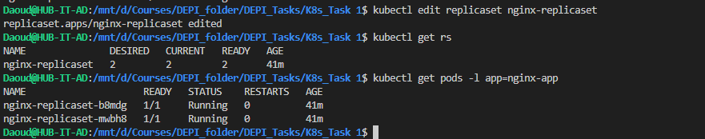 

------------------------------------------------------------------------------------------------------------------
------------------------------------------------------------------------------------------------------------------  

*** 11- find out the issue in the below Yaml (don't use AI) ***

apiVersion: apps/v1
kind: ReplicaSet
metadata:
  name: replicaset-2
spec:
  replicas: 2
  selector:
    matchLabels:
      tier: frontend
  template:
    metadata:
      labels:
        tier: nginx  ----> frontend
    spec:
      containers:
      - name: nginx
        image: nginx

   **Explanation:**
           In a ReplicaSet, the selector labels under .spec.selector.matchLabels must exactly match the labels defined in .spec.template.metadata.labels.
           Correct spelling must be:
                  tier: frontend
             
------------------------------------------------------------------------------------------------------------------
------------------------------------------------------------------------------------------------------------------ 

*** 12- find out the issue in the below Yaml (don't use AI) ***

apiVersion: apps/v1
kind: deployment                ---->>>>>  Deployment
metadata:
  name: deployment-1
spec:
  replicas: 2
  selector:
    matchLabels:
      name: busybox-pod
  template:
    metadata:
      labels:
        name: busybox-pod
    spec:
      containers:
      - name: busybox-container
        image: busybox
        command:
        - sh
        - "-c"
        - echo Hello Kubernetes! && sleep 3600

    
   **Explanation:**
           In Kubernetes, resource kinds are case-sensitive.
           Correct spelling must be: 
               kind: Deployment

------------------------------------------------------------------------------------------------------------------
------------------------------------------------------------------------------------------------------------------  

*** 13- find out the issue in the below Yaml (don't use AI) ***

apiVersion: v1 ------>>>>>> apps/v1
kind: Deployment
metadata:
  name: deployment-1
spec:
  replicas: 2
  selector:
    matchLabels:
      name: busybox-pod
  template:
    metadata:
      labels:
        name: busybox-pod
    spec:
      containers:
      - name: busybox-container
        image: busybox
        command:
        - sh
        - "-c"
        - echo Hello Kubernetes! && sleep 3600

   **Explanation:**
          Wrong API Version
             Deployment does not exist under apiVersion: v1.
          The correct API group is:
              apiVersion: apps/v1

------------------------------------------------------------------------------------------------------------------
------------------------------------------------------------------------------------------------------------------ 

*** 14- what's command you use to know what Image name that running the deployment ***

   **Explanation:**
          The command kubectl get deployment deployment-1 -o yaml | grep image: shows the Deployment config in YAML, then filters only the line containing the image.This way, you quickly see which container image  the Deployment is running.
   **Command used:**
         kubectl get deployment deployment-1 -o yaml | grep image:
   **Output of the command:**
        image: busybox
   **Screenshot:**          
          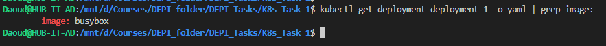 

------------------------------------------------------------------------------------------------------------------
------------------------------------------------------------------------------------------------------------------  

***/ 15- create deployment using following data : ***
                                        Name: httpd-frontend;
                                        Replicas: 3;
                                        Image: httpd:2.4-alpine ***
 

   **Explanation:**
            This YAML defines a Deployment named httpd-frontend with 3 replicas.
            Each Pod runs a container from the image httpd:2.4-alpine.
            A label app: httpd is used so the Deployment can manage its Pods.
   **Command used:**
            kubectl apply -f httpd-deployment.yml
            kubectl get deployment httpd-frontend
            kubectl get pods -l app=httpd
   **Output of the command:**
     
            deployment.apps/httpd-frontend created
     
            NAME             READY   UP-TO-DATE   AVAILABLE   AGE
            httpd-frontend   3/3     3            3           35s
         
            NAME                              READY   STATUS    RESTARTS   AGE
            httpd-frontend-6fdfd4754b-7t2wv   1/1     Running   0          40s
            httpd-frontend-6fdfd4754b-c882g   1/1     Running   0          40s
            httpd-frontend-6fdfd4754b-qrvfq   1/1     Running   0          40s
   **Screenshot:**          
          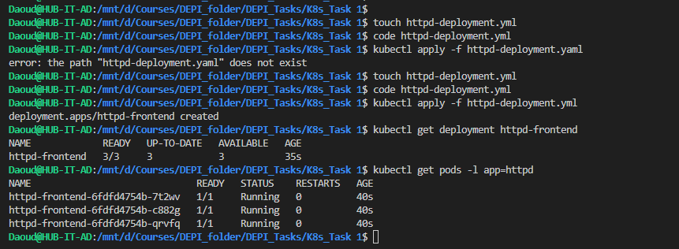   

------------------------------------------------------------------------------------------------------------------
------------------------------------------------------------------------------------------------------------------  

*** 16- replace the image to nginx777 with command directly  ***

   **Explanation:**
           We used kubectl set image to update the container image in the deployment.
           The deployment httpd-frontend now pulls the new image nginx777.
           Kubernetes automatically replaces old Pods with new ones using this image 
   **Command used:**
          
            kubectl set image deployment/httpd-frontend httpd-container=nginx777
            kubectl get deployment httpd-frontend -o wide
            kubectl describe deployment httpd-frontend | grep Image:
   **Output of the command:**

            deployment.apps/httpd-frontend image updated

            NAME             READY   UP-TO-DATE   AVAILABLE   AGE     CONTAINERS        IMAGES     SELECTOR
            httpd-frontend   3/3     1            3           9m22s   httpd-container   nginx777   app=httpd

                Image:         nginx777

   **Screenshot:**          
          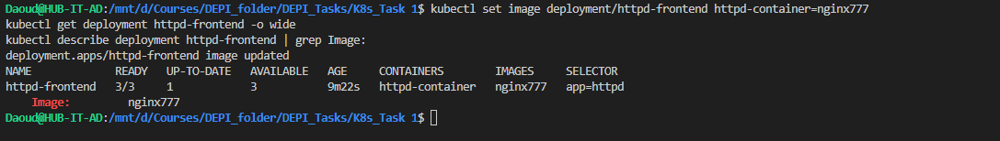 

------------------------------------------------------------------------------------------------------------------
------------------------------------------------------------------------------------------------------------------  

*** 17- rollback to pervious version ***

   **Explanation:**
            We used kubectl rollout undo to revert the deployment.
            This command rolls back the image and configuration to the last stable version.
            The Pods will restart and run the previous image again.
   **Command used:**
            kubectl rollout undo deployment/httpd-frontend
            kubectl get deployment httpd-frontend -o wide
            kubectl describe deployment httpd-frontend | grep Image:
   **Output of the command:**
            deployment.apps/httpd-frontend rolled back

            NAME             READY   UP-TO-DATE   AVAILABLE   AGE   CONTAINERS        IMAGES             SELECTOR
            httpd-frontend   3/3     3            3           16m   httpd-container   httpd:2.4-alpine   app=httpd

                Image:         httpd:2.4-alpine
   **Screenshot:**          
          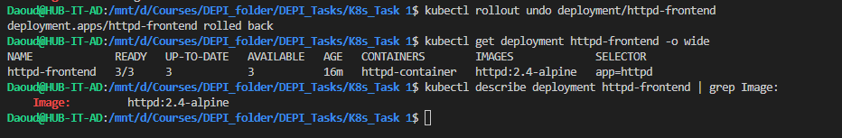 

------------------------------------------------------------------------------------------------------------------
------------------------------------------------------------------------------------------------------------------ 

***/ 18- Create a Simple Web Application: ***
                    * Use a Dockerfile to create a simple web application (e.g., an Nginx server serving an HTML page).
                    * Build the Docker image and push it to DockerHub your private Account.

   **Explanation:**
            We created a Dockerfile [Dockerfile](Dockerfile) using Nginx to serve a custom HTML page [index.html](index.html).Then we built the Docker image locally and tagged it with our DockerHub username.Finally, we pushed the image to our private DockerHub repository.
   **Command used and Output of the command:**

            Daoud@HUB-IT-AD:/mnt/d/Courses/DEPI_folder/DEPI_Tasks/K8s_Task 1$ touch Dockerfile
            Daoud@HUB-IT-AD:/mnt/d/Courses/DEPI_folder/DEPI_Tasks/K8s_Task 1$ touch index.html
#           Daoud@HUB-IT-AD:/mnt/d/Courses/DEPI_folder/DEPI_Tasks/K8s_Task 1$ docker build -t ahmeddaoud97/simple-web-app:1.0 .
            failed to fetch metadata: fork/exec /usr/local/lib/docker/cli-plugins/docker-buildx: no such file or directory

            DEPRECATED: The legacy builder is deprecated and will be removed in a future release.
                        Install the buildx component to build images with BuildKit:
                        https://docs.docker.com/go/buildx/

            Sending build context to Docker daemon    383kB
            Step 1/2 : FROM nginx:alpine
            alpine: Pulling from library/nginx
            ...
            ...
            Successfully built 61525d5d71f0
            Successfully tagged ahmeddaoud97/simple-web-app:1.0

#            Daoud@HUB-IT-AD:/mnt/d/Courses/DEPI_folder/DEPI_Tasks/K8s_Task 1$ docker login -u ahmeddaoud97

            i Info → A Personal Access Token (PAT) can be used instead.
                    To create a PAT, visit https://app.docker.com/settings

            Password:
            Login Succeeded
#           Daoud@HUB-IT-AD:/mnt/d/Courses/DEPI_folder/DEPI_Tasks/K8s_Task 1$ docker push ahmeddaoud97/simple-web-app:1.0
            The push refers to repository [docker.io/ahmeddaoud97/simple-web-app]
            1f8343fae847: Pushed
            f9985d3fc94d: Mounted from library/nginx
            d208138be39d: Mounted from library/nginx
            a2b76470e8f1: Mounted from library/nginx
            917b2c97271e: Mounted from library/nginx
            16ca725632e5: Mounted from library/nginx
            7978a9c91f72: Mounted from library/nginx
            b6ff0212304e: Mounted from library/nginx
            418dccb7d85a: Mounted from library/nginx
            1.0: digest: sha256:759e022ab0acdd9587e9215492ab6663f23b9dedf8fc7177d8ef650b04774649 size: 2196

   **Screenshot:**          
          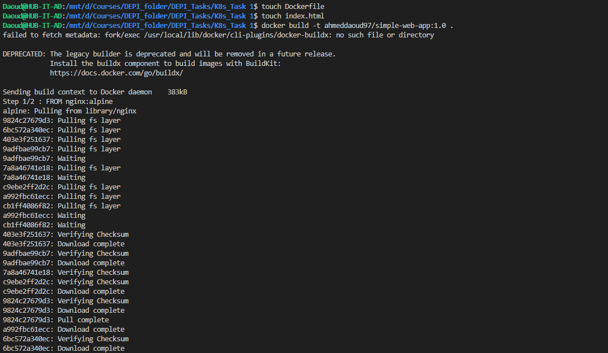 
          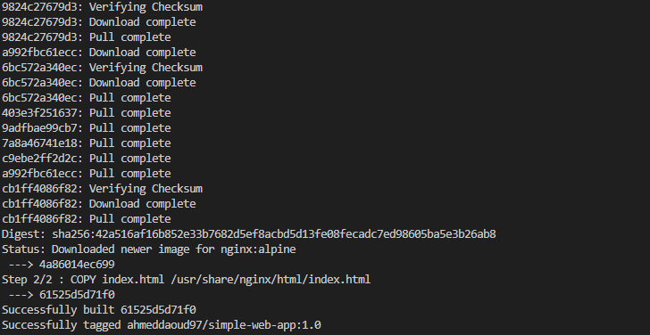 
          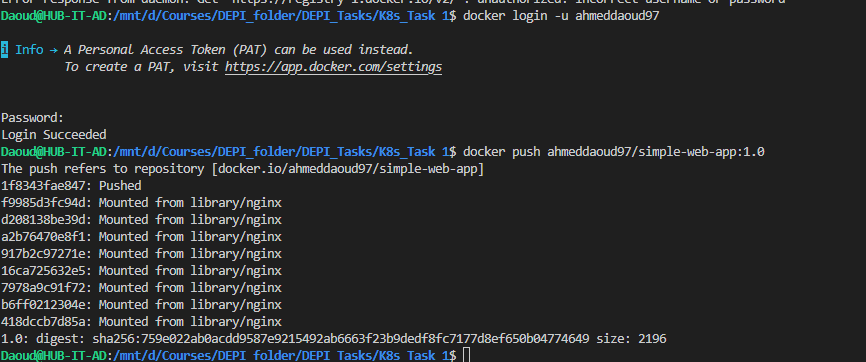                     

------------------------------------------------------------------------------------------------------------------
------------------------------------------------------------------------------------------------------------------  
***/ 19- Create a Deployment Using This Image: ***
    * Deploy the Docker image from DockerHub to Kubernetes with a Deployment that has 3 replicas.***

   **Explanation:**
            create a Kubernetes Deployment with 3 replicas using our DockerHub image [deployment.yml](deployment.yaml).Each pod runs an Nginx container serving the custom HTML page.The deployment ensures high availability by keeping 3 pods running.
   **Command used:**
            kubectl apply -f deployment.yaml
            kubectl get deployments
            kubectl get pods -l app=webapp
   **Output of the command:**
            deployment.apps/simple-web-app created

            NAME             READY   UP-TO-DATE   AVAILABLE   AGE
            deployment-1     2/2     2            2           115m
            httpd-frontend   3/3     3            3           65m
            simple-web-app   0/3     3            0           9s

            NAME                              READY   STATUS    RESTARTS   AGE
            simple-web-app-855884f649-7shpr   1/1     Running   0          42s
            simple-web-app-855884f649-sc7jz   1/1     Running   0          42s
            simple-web-app-855884f649-zdn8z   1/1     Running   0          42s
   **Screenshot:**          
          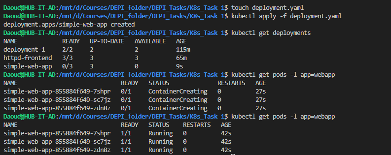 
