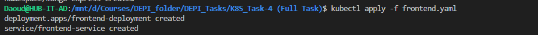
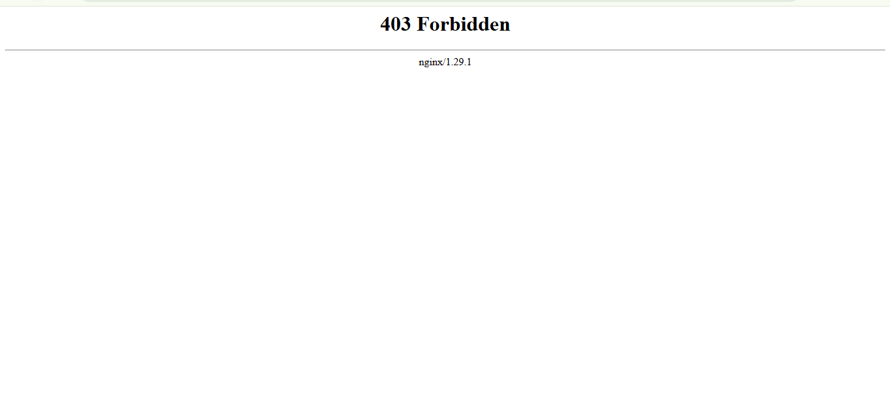
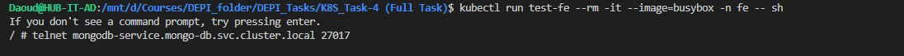

# Kubernetes Full Task

## Task Overview
This project demonstrates a full Kubernetes setup using **Minikube with 2 nodes**.  
It includes:
- Frontend (Nginx) application
- MongoDB database
- Mongo Express web client
- Secrets, ConfigMaps, PVCs
- NetworkPolicy for security
- Taints & Tolerations for scheduling

---

## Steps to Deploy

### 1. Start Minikube with 2 nodes
```bash
minikube start --nodes=2 --driver=docker
kubectl get nodes -o wide
```
Result:  


---

### 2. Create Namespaces
```bash
kubectl apply -f namespaces.yaml
kubectl get ns
```
Result:  


---

### 3. Deploy Frontend (Nginx)
```bash
kubectl apply -f frontend.yaml
kubectl get all -n fe
minikube service frontend-service -n fe --url
```
Result:  
  


---

### 4. Deploy MongoDB
```bash
kubectl apply -f mongodb-secret.yaml
kubectl apply -f mongodb-pv-pvc.yaml
kubectl apply -f mongodb.yaml
kubectl get all -n mongo-db
```
Result:  


---

### 5. Deploy Mongo Express
```bash
kubectl apply -f mongo-express-configmap.yaml
kubectl apply -f mongodb-secret-mongo-express.yaml
kubectl apply -f mongo-express.yaml
kubectl get all -n mongo-express
minikube service mongo-express-service -n mongo-express --url
```
Result:  
  


---

### 6. Apply NetworkPolicy
```bash
kubectl apply -f networkpolicy.yaml
kubectl get networkpolicy -n mongo-db
```
Result:  


---

### 7. Apply Taint & Verify Toleration
```bash
kubectl taint nodes minikube-m02 db=NoSchedule:NoSchedule
kubectl describe node minikube-m02 | grep Taints
```
Result:  


---

###  File Structure

```
K8S_Task-4/
│
├── namespaces.yaml
├── frontend.yaml
│
├── mongodb-secret.yaml
├── mongodb-pv-pvc.yaml
├── mongodb.yaml
│
├── mongo-express-configmap.yaml
├── mongodb-secret-mongo-express.yaml
├── mongo-express.yaml
│
└── networkpolicy.yaml
```

---

##  Verification

- **Frontend**:  
 Accessible on NodePort (default `30080`):
 Verifies that the frontend is exposed correctly via NodePort.
  
  ```bash
  minikube service frontend-service -n fe --url
  ```
  Result:  
  

- **MongoDB**:  
  Internal ClusterIP (port `27017`):
  Verifies that MongoDB is only accessible internally within the cluster.
  ```bash
  kubectl get svc -n mongo-db
  ```
   Result:  
  
- **Mongo Express**:  
  Accessible on NodePort (default `30081`):
  Verifies that Mongo Express is exposed externally and accessible via NodePort.
  ```bash
  minikube service mongo-express-service -n mongo-express --url
  ```
   Result:  
  
- **NetworkPolicy**:  
  Ensures MongoDB only accepts traffic from `mongo-express` namespace:
  Verifies that MongoDB rejects connections from fe namespace but allows from mongo-express
  ```bash
  # # not-accepts-traffic-from-fe-namespaces
  kubectl run test-fe --rm -it --image=busybox -n fe -- sh
  telnet mongodb-service.mongo-db.svc.cluster.local 27017
  # # accepts-traffic-from-`mongo-express`-namespacex
  kubectl exec -it -n mongo-express deploy/mongo-express-deployment -- sh
  apk add --no-cache busybox-extras
  telnet mongodb-service.mongo-db.svc.cluster.local 27017
  ```
   Result: 
   
  

- **Taints & Tolerations**:  
  `minikube-m02` tainted, MongoDB tolerates it:
  Verifies that MongoDB Pod is scheduled on the tainted node because it has toleration.
  ```bash
  kubectl describe node minikube-m02 | grep Taints
  kubectl get pod -n mongo-db -o wide
  ```
   Result: 
   
---

## 👨‍💻 Author
Ahmed Mohamed Daoud  
